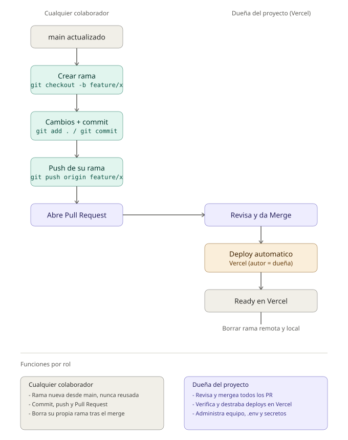

# Guía de contribución

Flujo de trabajo para hacer cambios en este repo sin pisar el trabajo de otros
colaboradores y sin bloquear el deploy automático en Vercel (plan Hobby).



## Antes de empezar

`main` está conectado a Vercel. El plan Hobby no soporta colaboración: un
deploy solo se dispara sin bloqueo si el push/merge final a `main` queda
asociado a la cuenta dueña del proyecto en Vercel. Por eso, **quien mergea
los Pull Requests en GitHub es siempre la dueña del proyecto**, sin importar
quién escribió el código.

## Roles

### Cualquier colaborador (incluye a la dueña cuando escribe código)

- Sigue el flujo de la sección siguiente: rama nueva → cambios → commit →
  push de su rama → abre PR.
- Nunca comitea directo sobre `main`.
- Nunca reutiliza una rama ya fusionada.
- Borra su propia rama (remota y local) después de que se mergea su PR.

### Dueña del proyecto (`hcardenasarz`, cuenta de Vercel y GitHub)

Además de poder contribuir código como cualquiera, tiene estas funciones
propias porque es quien tiene la cuenta de Vercel:

- **Revisa y mergea todos los Pull Requests** en GitHub — los suyos y los de
  cualquier otro colaborador — para que el commit de merge quede con su
  autoría y el deploy no quede bloqueado.
- **Verifica el deploy** en la pestaña Deployments de Vercel después de
  cada merge.
- **Destraba deploys bloqueados** con el push vacío (paso 7 más abajo) si
  Vercel rechaza un commit por permisos.
- **Administra el equipo de Vercel** (Team Settings → Members) si en algún
  momento se actualiza a un plan que sí permita agregar colaboradores.
- **Gestiona las variables de entorno y secretos** (`.env`, claves de
  Supabase, tokens de Meta/WhatsApp) — nadie más debería necesitar tocarlos
  para contribuir código.

## Flujo para cualquier cambio (aplica a todos los colaboradores)

### 1. Actualizar `main` local

```bash
git checkout main
git pull origin main
```

### 2. Crear una rama nueva

Nunca reutilices una rama ya fusionada — eso fue justo lo que causó un
commit huérfano que no llegó a `main` la primera vez.

```bash
git checkout -b feature/nombre-descriptivo
```

### 3. Hacer los cambios y commitear

```bash
git add .
git commit -m "Descripción del cambio"
```

### 4. Subir la rama (push)

```bash
git push -u origin feature/nombre-descriptivo
```

> **Commit vs. push vs. merge**
> - **Commit**: guarda el cambio en tu historial local.
> - **Push**: sube tus commits/rama a GitHub. No mezcla nada con `main`.
> - **Merge**: combina los commits de una rama dentro de otra (local con
>   `git merge`, o en GitHub al aceptar un Pull Request).

### 5. Abrir un Pull Request en GitHub

De tu rama hacia `main`. Esto deja un registro claro del cambio y permite
que se revise antes de llegar a producción.

### 6. Merge del PR

Lo hace la dueña del proyecto en Vercel, para que el commit de merge quede
con su autoría y el deploy no se bloquee.

### 7. Verificar el deploy en Vercel

Pestaña **Deployments** → esperar que pase de "Building" a "Ready".

Si el deploy queda bloqueado con el error *"the commit author doesn't have
permission to create deployments for this project"*, se destraba con un
push vacío hecho por la dueña de la cuenta:

```bash
git checkout main
git pull origin main
git commit --allow-empty -m "chore: trigger redeploy"
git push origin main
```

## Borrar una rama después del merge

Borrar en GitHub no borra la copia local, y viceversa — hay que limpiar
ambas.

### 1. Rama remota (GitHub)

Botón **"Delete branch"** que aparece en la página del PR justo después de
mergear. O por terminal:

```bash
git push origin --delete feature/nombre-descriptivo
```

### 2. Rama local

```bash
git checkout main
git pull origin main
git branch -d feature/nombre-descriptivo
```

`-d` (minúscula) es la opción segura: solo borra si Git detecta que la rama
ya fue fusionada a la rama en la que estás parado. Evita `-D` (mayúscula)
salvo que sepas con certeza que quieres forzar el borrado sin haber
mergeado — así es como se puede perder trabajo sin darse cuenta.

### 3. Limpiar referencias a ramas remotas ya borradas

Con el tiempo se acumulan referencias locales a ramas que ya no existen en
GitHub. Cada colaborador debería correr esto de vez en cuando:

```bash
git fetch --prune
```

## Resumen

```
cualquiera: main actualizado → rama nueva → cambios → commit → push de su rama → abre PR
dueña:      revisa el PR → merge en GitHub → Vercel despliega automático
ambos:      borran la rama (remota y local) → git fetch --prune
```
